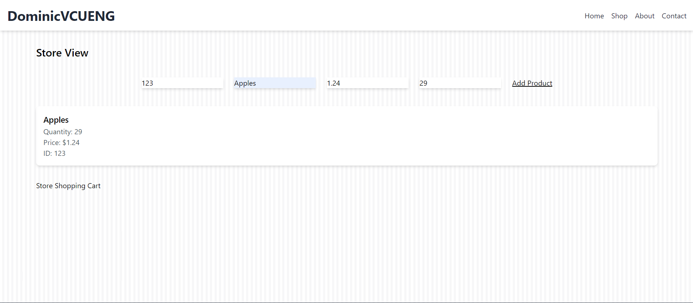
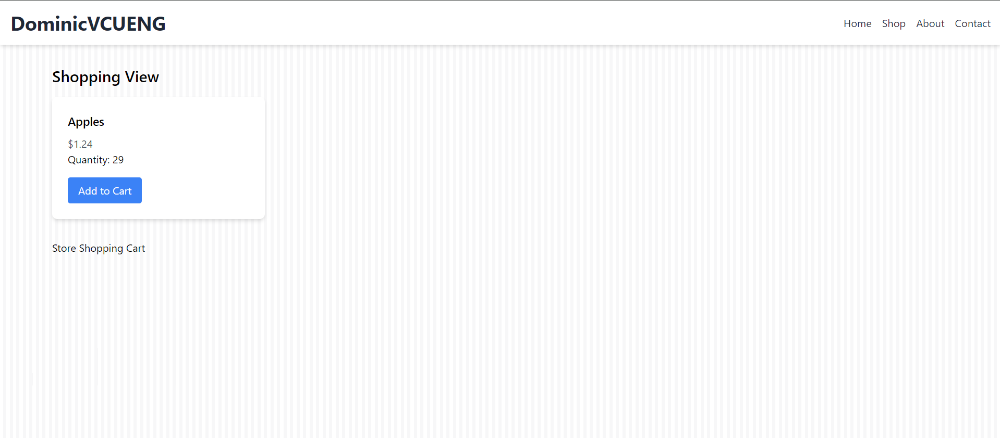
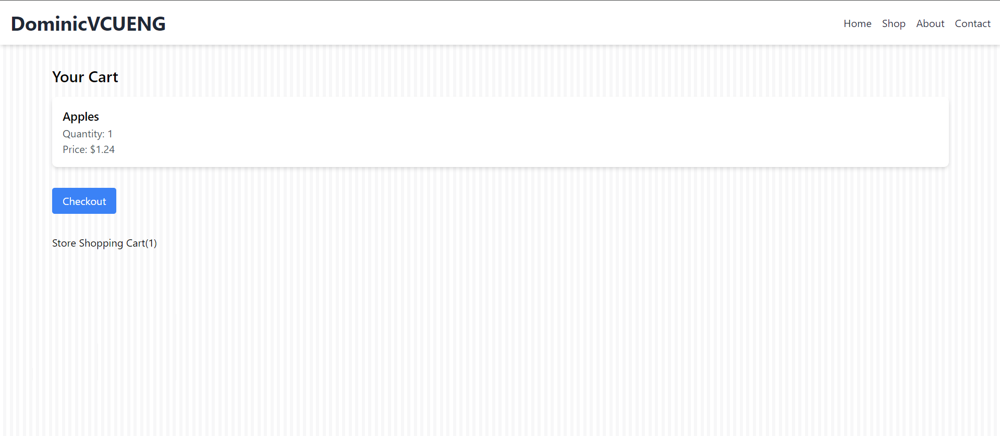
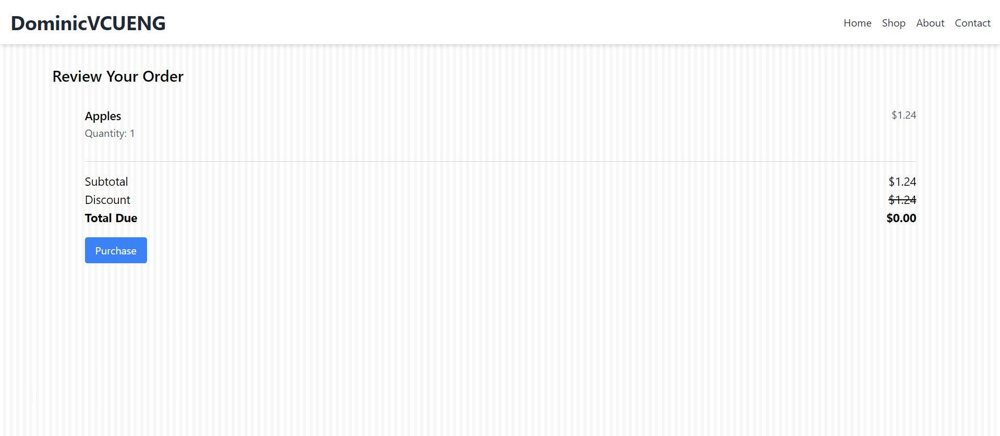

# Online Shopping Website

Welcome to the Online Shopping Website project! This repository contains the front-end code for a basic online shopping platform.

## Overview
This project demonstrates a simple online shopping website where users can browse products and manage their shopping cart.

## Features
- Product Listing: Browse a list of available products.
- Shopping Cart: Add and remove items from your shopping cart.
- Responsive Design: Optimized for both desktop and mobile devices.

## Technologies Used
- HTML: Structure of the web pages.
- CSS: Styling of the web pages.
- JavaScript: Functionality and interactivity.
- Tailwind CSS: Utility-first CSS framework for styling.
- Fetch API: For making requests to the back-end.

## How to Run
1. Clone the repository:

```
git clone https://github.com/DominicVCUENG/Shopping-Service
```

2. Navigate to the project directory:

```
cd Shopping-Service
```

3. Open 'index.html' in your web browser to view the website.

## Project Structure
- index.html: The main landing page.

- views/: Contains additional HTML files for other pages.

- `styles.css`: A CSS file for styling.

- `app.js`: A JavaScript file for functionality.

## Screenshots








